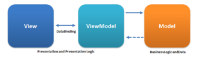

# MVVM-Sample (Swift) for iOS

MVVM (Model View ViewModel) is an architectural pattern based on MVC and MVP, which attempts to more clearly separate the development of user-interfaces (UI) from that of the business logic and behaviour in an application. 

 

Project
-----
* `ApiClient.swift` - Fake class to obtain the data.
* `Data.swift` - Data model with the information to show in the table.
* `DataViewModel.swift` - Manage and format the data to be displayed in the views.
* `CustomTableViewCell.swift` - The cell that contain the data

Developed By
-----
Keval Gajjar kevalunchadiya92@gmail.com

# MVVMSample
# MVVMSample
